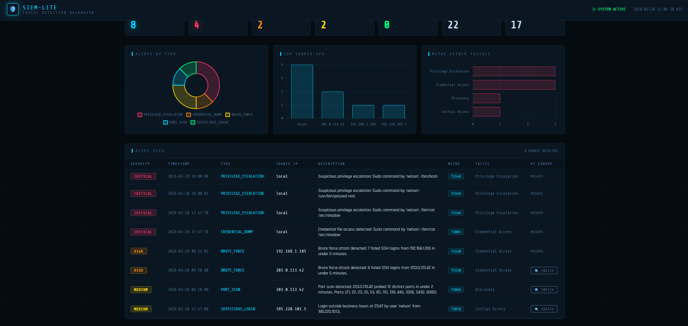
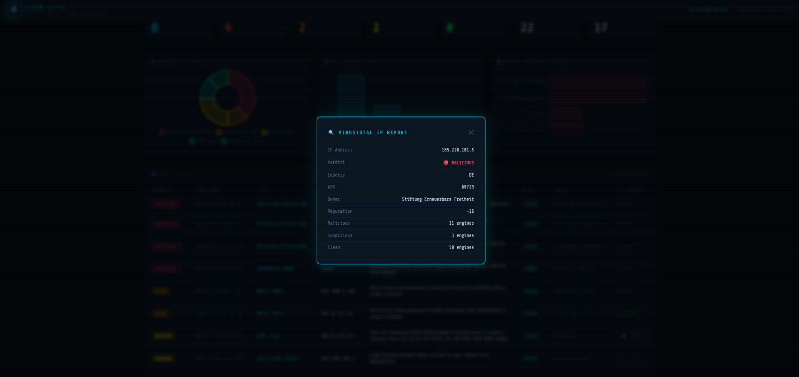
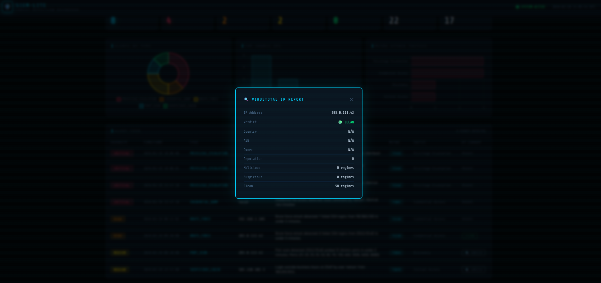

# 🛡️ SIEM-Lite — Log Analysis & Threat Detection Dashboard

A lightweight, fully functional SIEM built in Python that ingests real Linux and firewall logs, detects attack patterns, classifies them using the **MITRE ATT&CK framework**, and visualizes everything in a real-time web dashboard with **VirusTotal IP enrichment**.

> Built as a hands-on SOC portfolio project during a career transition from 10 years in physical security operations to cybersecurity.

---

## 📸 Screenshots

### Main Dashboard


### VirusTotal IP Enrichment — MALICIOUS


### VirusTotal IP Enrichment — CLEAN


---

## 🚀 Features

- **Log Ingestion** — Parses Linux `auth.log` and UFW firewall logs into a normalized format
- **Threat Detection Engine** — 5 detection rules with configurable thresholds:
  - 🔴 SSH Brute Force (≥5 failed logins in 5 min)
  - 🟠 Port Scan (≥8 distinct ports in 2 min)
  - 🔴 Privilege Escalation (suspicious sudo commands)
  - 🔴 Credential Dumping (`/etc/shadow` access)
  - 🟡 Off-Hours Login (connections outside business hours)
- **MITRE ATT&CK Mapping** — Every alert tagged with technique ID and tactic
- **Real-Time Dashboard** — Flask web app with Chart.js visualizations
- **VirusTotal Enrichment** — On-demand IP reputation lookup via VT API v3

---

## 🎯 Detection Rules & MITRE ATT&CK

| Rule | MITRE ID | Tactic | Severity |
|------|----------|--------|----------|
| SSH Brute Force | T1110 | Credential Access | 🔴 HIGH |
| Port Scan | T1046 | Discovery | 🟡 MEDIUM |
| Privilege Escalation | T1548 | Privilege Escalation | 🔴 CRITICAL |
| Credential Dumping | T1003 | Credential Access | 🔴 CRITICAL |
| Off-Hours Login | T1078 | Initial Access | 🟡 MEDIUM |

---

## 🛠️ Tech Stack

| Layer | Technology |
|-------|-----------|
| Backend | Python 3.11, Flask |
| Data Processing | Pandas |
| Frontend | HTML, CSS, JavaScript, Chart.js |
| Threat Intelligence | VirusTotal API v3 |
| Framework | MITRE ATT&CK |
| Environment | python-dotenv |

---

## ⚙️ Setup & Installation

### 1. Clone the repository
```bash
git clone https://github.com/NSVEXL/siem-lite.git
cd siem-lite
```

### 2. Install dependencies
```bash
pip install -r requirements.txt
```

### 3. Configure VirusTotal API key
```bash
cp .env.example .env
# Edit .env and add your VT API key
# Get a free key at: https://www.virustotal.com/gui/my-apikey
```

### 4. Run the dashboard
```bash
python app.py
```

Open your browser at **http://localhost:5000**

---

## 📁 Project Structure

```
siem-lite/
├── app.py                  # Flask web application
├── requirements.txt
├── .env.example
├── logs/
│   └── samples/
│       ├── auth.log        # Sample Linux auth log
│       └── firewall.log    # Sample UFW firewall log
├── src/
│   ├── parser/
│   │   └── log_parser.py   # Log ingestion & normalization
│   ├── detector/
│   │   └── detection_engine.py  # Threat detection rules
│   └── enrichment/
│       └── vt_enrichment.py     # VirusTotal API integration
└── templates/
    └── dashboard.html      # Web dashboard
```

---

## 🔍 How It Works

1. **Parse** — Raw log files are parsed with regex patterns and normalized into a common schema (timestamp, event_type, source_ip, user, details)
2. **Detect** — The detection engine applies rule-based logic with time-window analysis to identify attack patterns
3. **Classify** — Each alert is mapped to a MITRE ATT&CK technique and tactic
4. **Visualize** — Flask renders the dashboard with real-time charts and a sortable alert feed
5. **Enrich** — On-demand VirusTotal lookups provide threat intelligence context for suspicious IPs

---

## 🧪 Sample Detection Output

```
[CRITICAL] PRIVILEGE_ESCALATION  | local           | T1548
[CRITICAL] CREDENTIAL_DUMP       | local           | T1003
[HIGH    ] BRUTE_FORCE            | 203.0.113.42    | T1110
[HIGH    ] BRUTE_FORCE            | 192.168.1.105   | T1110
[MEDIUM  ] PORT_SCAN              | 203.0.113.42    | T1046
[MEDIUM  ] SUSPICIOUS_LOGIN       | 185.220.101.5   | T1078
```

> Real VirusTotal result: `185.220.101.5` → **MALICIOUS** — 11 engines flagged, reputation -16, Tor exit node (DE)

---

## 📋 Roadmap

- [x] Phase 1 — Log parser (auth.log + firewall logs)
- [x] Phase 2 — Threat detection engine with MITRE ATT&CK mapping
- [x] Phase 3 — Web dashboard with Chart.js visualizations
- [x] Phase 4 — VirusTotal IP enrichment
- [ ] Phase 5 — Windows Event Log support
- [ ] Phase 6 — Export alerts to CSV/PDF report

---

## 👨‍💻 About

Built by **[Nelson Silva Valderas](https://github.com/NSVEXL)** as a hands-on SOC portfolio project.

10 years in physical security operations → Cybersecurity transition. This project applies real SOC analyst workflows: log ingestion, correlation, alert triage, and threat intelligence enrichment.

[](https://www.linkedin.com/in/nelson-silva-valderas/)
[](https://tryhackme.com/p/ERXL)
